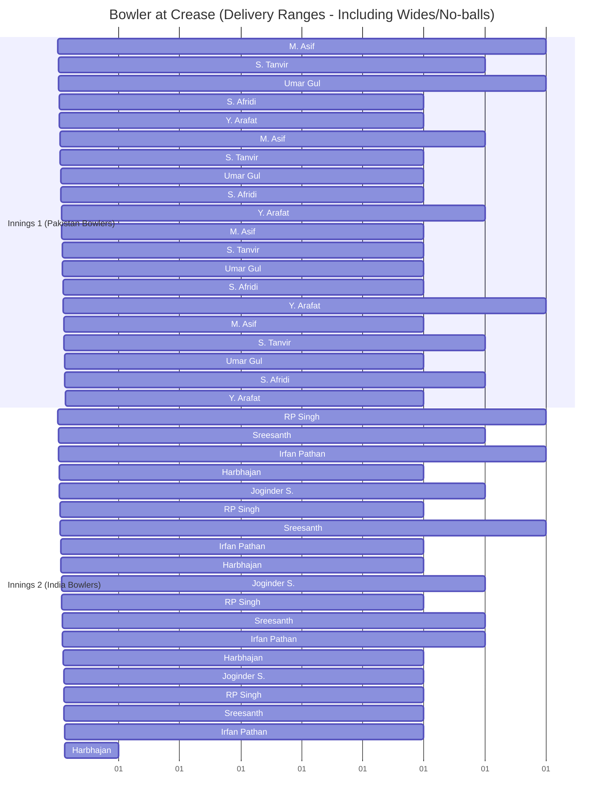

```mermaid
gantt
    title Bowler at Crease (Delivery Ranges - Including Wides/No-balls)
    dateFormat X
    axisFormat %d

    section Innings 1 (Pakistan Bowlers)
    M. Asif : 1, 8
    S. Tanvir : 9, 7
    Umar Gul : 16, 8
    S. Afridi : 24, 6
    Y. Arafat : 30, 6
    M. Asif : 36, 7
    S. Tanvir : 43, 6
    Umar Gul : 49, 6
    S. Afridi : 55, 6
    Y. Arafat : 61, 7
    M. Asif : 68, 6
    S. Tanvir : 74, 6
    Umar Gul : 80, 6
    S. Afridi : 86, 6
    Y. Arafat : 92, 8
    M. Asif : 100, 6
    S. Tanvir : 106, 7
    Umar Gul : 113, 6
    S. Afridi : 119, 7
    Y. Arafat : 126, 6
    section Innings 2 (India Bowlers)
    RP Singh : 1, 8
    Sreesanth : 9, 7
    Irfan Pathan : 16, 8
    Harbhajan : 24, 6
    Joginder S. : 30, 7
    RP Singh : 37, 6
    Sreesanth : 43, 8
    Irfan Pathan : 51, 6
    Harbhajan : 57, 6
    Joginder S. : 63, 7
    RP Singh : 70, 6
    Sreesanth : 76, 7
    Irfan Pathan : 83, 7
    Harbhajan : 90, 6
    Joginder S. : 96, 6
    RP Singh : 102, 6
    Sreesanth : 108, 6
    Irfan Pathan : 114, 6
    Harbhajan : 120, 1
```
