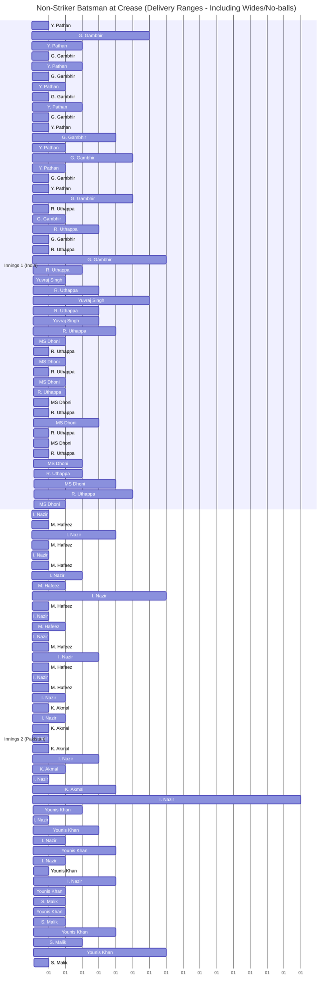

```mermaid
gantt
    title Non-Striker Batsman at Crease (Delivery Ranges - Including Wides/No-balls)
    dateFormat X
    axisFormat %d

    section Innings 1 (India)
    Y. Pathan : 1, 1
    G. Gambhir : 2, 7
    Y. Pathan : 9, 3
    G. Gambhir : 12, 1
    Y. Pathan : 13, 3
    G. Gambhir : 16, 1
    Y. Pathan : 17, 2
    G. Gambhir : 19, 1
    Y. Pathan : 20, 3
    G. Gambhir : 23, 1
    Y. Pathan : 24, 1
    G. Gambhir : 25, 5
    Y. Pathan : 30, 2
    G. Gambhir : 32, 6
    Y. Pathan : 38, 2
    G. Gambhir : 40, 1
    Y. Pathan : 41, 1
    G. Gambhir : 42, 6
    R. Uthappa : 48, 1
    G. Gambhir : 49, 2
    R. Uthappa : 51, 4
    G. Gambhir : 55, 1
    R. Uthappa : 56, 1
    G. Gambhir : 57, 8
    R. Uthappa : 65, 3
    Yuvraj Singh : 68, 2
    R. Uthappa : 70, 4
    Yuvraj Singh : 74, 7
    R. Uthappa : 81, 4
    Yuvraj Singh : 85, 4
    R. Uthappa : 89, 5
    MS Dhoni : 94, 2
    R. Uthappa : 96, 1
    MS Dhoni : 97, 2
    R. Uthappa : 99, 1
    MS Dhoni : 100, 2
    R. Uthappa : 102, 2
    MS Dhoni : 104, 1
    R. Uthappa : 105, 1
    MS Dhoni : 106, 4
    R. Uthappa : 110, 1
    MS Dhoni : 111, 1
    R. Uthappa : 112, 1
    MS Dhoni : 113, 3
    R. Uthappa : 116, 3
    MS Dhoni : 119, 5
    R. Uthappa : 124, 6
    MS Dhoni : 130, 2
    section Innings 2 (Pakistan)
    I. Nazir : 1, 1
    M. Hafeez : 2, 1
    I. Nazir : 3, 5
    M. Hafeez : 8, 1
    I. Nazir : 9, 1
    M. Hafeez : 10, 1
    I. Nazir : 11, 3
    M. Hafeez : 14, 2
    I. Nazir : 16, 8
    M. Hafeez : 24, 1
    I. Nazir : 25, 1
    M. Hafeez : 26, 2
    I. Nazir : 28, 1
    M. Hafeez : 29, 1
    I. Nazir : 30, 4
    M. Hafeez : 34, 1
    I. Nazir : 35, 1
    M. Hafeez : 36, 1
    I. Nazir : 37, 2
    K. Akmal : 39, 1
    I. Nazir : 40, 2
    K. Akmal : 42, 1
    I. Nazir : 43, 1
    K. Akmal : 44, 1
    I. Nazir : 45, 4
    K. Akmal : 49, 2
    I. Nazir : 51, 1
    K. Akmal : 52, 5
    I. Nazir : 57, 16
    Younis Khan : 73, 3
    I. Nazir : 76, 1
    Younis Khan : 77, 4
    I. Nazir : 81, 2
    Younis Khan : 83, 5
    I. Nazir : 88, 2
    Younis Khan : 90, 1
    I. Nazir : 91, 5
    Younis Khan : 96, 2
    S. Malik : 98, 2
    Younis Khan : 100, 2
    S. Malik : 102, 2
    Younis Khan : 104, 5
    S. Malik : 109, 3
    Younis Khan : 112, 8
    S. Malik : 120, 1
```
