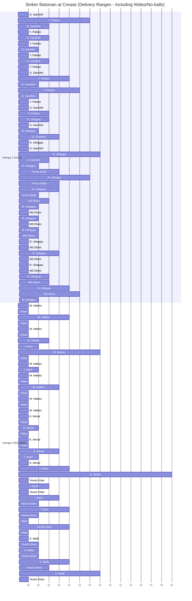

```mermaid
gantt
    title Striker Batsman at Crease (Delivery Ranges - Including Wides/No-balls)
    dateFormat X
    axisFormat %d

    section Innings 1 (India)
    G. Gambhir : 1, 1
    Y. Pathan : 2, 7
    G. Gambhir : 9, 3
    Y. Pathan : 12, 1
    G. Gambhir : 13, 3
    Y. Pathan : 16, 1
    G. Gambhir : 17, 2
    Y. Pathan : 19, 1
    G. Gambhir : 20, 3
    Y. Pathan : 23, 1
    G. Gambhir : 24, 1
    Y. Pathan : 25, 5
    G. Gambhir : 30, 2
    Y. Pathan : 32, 6
    G. Gambhir : 38, 2
    Y. Pathan : 40, 1
    G. Gambhir : 41, 1
    Y. Pathan : 42, 3
    R. Uthappa : 45, 3
    G. Gambhir : 48, 1
    R. Uthappa : 49, 2
    G. Gambhir : 51, 4
    R. Uthappa : 55, 1
    G. Gambhir : 56, 1
    R. Uthappa : 57, 8
    G. Gambhir : 65, 3
    R. Uthappa : 68, 2
    Yuvraj Singh : 70, 4
    R. Uthappa : 74, 7
    Yuvraj Singh : 81, 4
    R. Uthappa : 85, 4
    Yuvraj Singh : 89, 2
    MS Dhoni : 91, 3
    R. Uthappa : 94, 2
    MS Dhoni : 96, 1
    R. Uthappa : 97, 2
    MS Dhoni : 99, 1
    R. Uthappa : 100, 2
    MS Dhoni : 102, 2
    R. Uthappa : 104, 1
    MS Dhoni : 105, 1
    R. Uthappa : 106, 4
    MS Dhoni : 110, 1
    R. Uthappa : 111, 1
    MS Dhoni : 112, 1
    R. Uthappa : 113, 3
    MS Dhoni : 116, 3
    R. Uthappa : 119, 5
    MS Dhoni : 124, 6
    R. Uthappa : 130, 2
    section Innings 2 (Pakistan)
    M. Hafeez : 1, 1
    I. Nazir : 2, 1
    M. Hafeez : 3, 5
    I. Nazir : 8, 1
    M. Hafeez : 9, 1
    I. Nazir : 10, 1
    M. Hafeez : 11, 3
    I. Nazir : 14, 2
    M. Hafeez : 16, 8
    I. Nazir : 24, 1
    M. Hafeez : 25, 1
    I. Nazir : 26, 2
    M. Hafeez : 28, 1
    I. Nazir : 29, 1
    M. Hafeez : 30, 4
    I. Nazir : 34, 1
    M. Hafeez : 35, 1
    I. Nazir : 36, 1
    M. Hafeez : 37, 1
    K. Akmal : 38, 1
    I. Nazir : 39, 1
    K. Akmal : 40, 2
    I. Nazir : 42, 1
    K. Akmal : 43, 1
    I. Nazir : 44, 1
    K. Akmal : 45, 4
    I. Nazir : 49, 2
    K. Akmal : 51, 1
    I. Nazir : 52, 5
    K. Akmal : 57, 15
    Younis Khan : 72, 1
    I. Nazir : 73, 3
    Younis Khan : 76, 1
    I. Nazir : 77, 4
    Younis Khan : 81, 2
    I. Nazir : 83, 5
    Younis Khan : 88, 2
    I. Nazir : 90, 1
    Younis Khan : 91, 5
    I. Nazir : 96, 1
    S. Malik : 97, 1
    Younis Khan : 98, 2
    S. Malik : 100, 2
    Younis Khan : 102, 2
    S. Malik : 104, 5
    Younis Khan : 109, 3
    S. Malik : 112, 8
    Younis Khan : 120, 1
```
